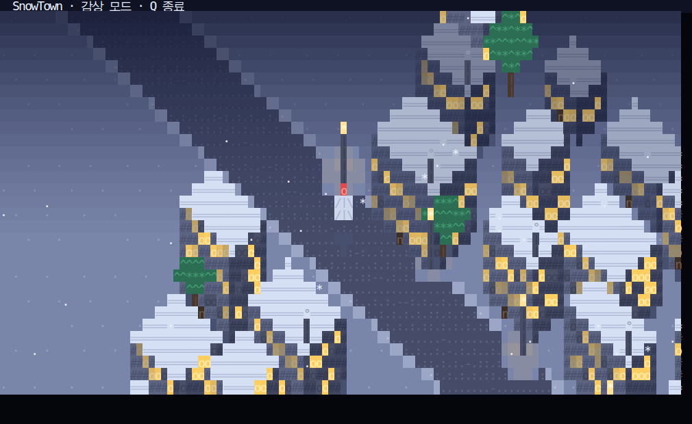
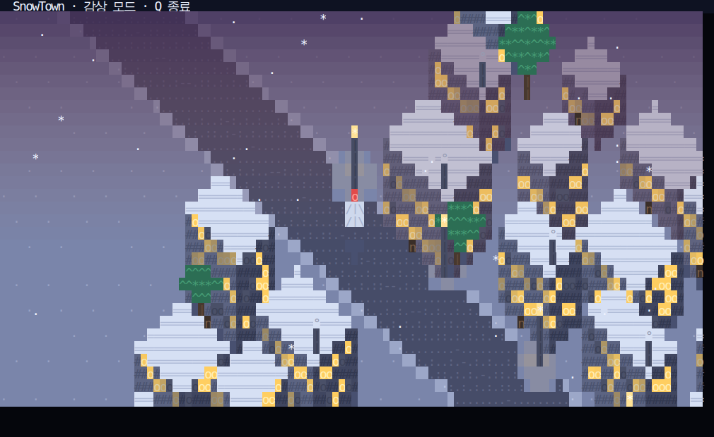

# SnowTown ❄

ASCII 문자만으로 그리는 **아이소메트릭(등각 투영) 3D** 겨울 마을 미니게임.
표준 라이브러리만 쓰므로 설치할 것이 없습니다.

- 등각 투영으로 건물을 상자로 그려 지붕·두 면(빛/그늘)이 보입니다
- 멀수록 하늘색으로 흐려지는 원근 안개, 눈밭에 번지는 가로등 불빛, 지붕 위 눈
- 낮밤 순환(밤 → 새벽 → 밤), 눈·별·굴뚝 연기, 도로 차선
- 플레이어를 중심으로 카메라가 따라가며 마을이 흘러갑니다




## 실행

### macOS / Linux

```bash
cd "$HOME/hermes agent/snowtown"
python3 snowtown.py             # 게임 시작 (60초 동안 떨어지는 선물 받기)
python3 snowtown.py --demo      # 조작 없이 감상 (수업 프로젝션·스크린세이버용)
python3 snowtown.py --fps 12    # 원격(SSH) 접속이 느릴 때 프레임 낮추기
python3 snowtown.py --no-bg     # 배경색이 깨지는 터미널용
python3 snowtown.py --no-alt    # 대체 화면을 못 쓰는 터미널용
python3 snowtown.py --no-color  # 색 없이 (단색 터미널)
```

렌더링 참고: 110x32 기준 프레임당 약 39KB를 출력합니다(20fps ≈ 770KB/s).
로컬 터미널에서는 문제없고, 원격 접속이 느리면 `--fps 12` 또는 `--no-bg` 를 쓰세요.

### Windows

**준비 (최초 1회)** — Python 3.8 이상이 필요합니다.

```powershell
winget install Python.Python.3.12
```

또는 python.org 에서 설치할 때 **"Add python.exe to PATH"** 를 반드시 체크하세요.
터미널은 **Windows Terminal**(Microsoft Store에서 무료)을 권장합니다. (Windows 10 1809+ / 11)

**실행** — 저장소 폴더에서:

```bat
run.bat                 :: 더블클릭해도 됨
run.bat --demo          :: 감상 모드
py -3 snowtown.py       :: 직접 실행
```

`run.bat` 은 UTF-8 코드페이지를 켜고(`chcp 65001`) `py`/`python` 을 자동으로 골라 실행하며,
오류가 나면 창이 닫히지 않고 메시지를 보여줍니다.

윈도우 관련 참고:
- 윈도우에서는 `msvcrt` 로 키 입력을 받고, 콘솔 모드(VT 시퀀스 허용)를 코드에서 켜므로 별도 설정이 필요 없습니다.
- 아주 오래된 레거시 콘솔에서는 색이 256색으로 떨어질 수 있습니다(동작은 동일).
- `Ctrl+C` 로 언제든 종료할 수 있고, 종료 시 화면·커서 상태를 원래대로 되돌립니다.

색은 트루컬러 → 256색 → 단색으로 자동 강등되므로 어떤 터미널에서도 동작합니다.

## 조작

| 키 | 동작 |
|---|---|
| `←` `→` 또는 `A` `D` | 좌우 이동 |
| `Space` / `W` / `↑` | 점프 |
| `R` | 게임 오버 후 다시 시작 |
| `Q` (또는 `Ctrl+C`) | 종료 |

60초 동안 하늘에서 떨어지는 선물 `[ ]`을 받으면 점수가 올라가고, 놓치면 놓침 수가 올라갑니다.
시간이 끝나면 결과 창이 뜹니다.

## 화면 구성

- **투영**: 아이소메트릭(`AX, AY, AZ` 계수). 월드 좌표 → 화면 좌표 변환은 `class Iso`
- **건물**: 지붕(눈) + 앞-왼쪽 면(빛) + 앞-오른쪽 면(그늘) 3면을 역매핑으로 채움.
  창문은 반짝이고, 문·굴뚝·연기까지 그립니다
- **지면**: 무한 눈 평면(필요한 칸만 계산). 도로 띠와 중앙 차선, 길가 눈더미
- **원근 안개**: 화면 위쪽(먼 곳)일수록 하늘색에 가깝게 섞어 깊이감을 만듭니다
- **가로등**: 눈밭에 따뜻한 빛 풀을 만들고 전구가 깜빡입니다
- **날씨**: 눈, 별(반짝임), 달, 굴뚝 연기
- **플레이어**: 카메라가 플레이어를 화면 하단 60% 지점에 고정합니다

## 파일 구조

```
snowtown/
├── snowtown.py          # 게임 본체 (아이소메트릭 렌더러 + 게임 루프 + 터미널 제어, 유닉스/윈도우 공용)
├── run.bat              # 윈도우 실행 런처
├── tools/
│   ├── preview.py       # 프레임을 HTML로 렌더 (스크린샷 검증용)
│   ├── html_shot.mjs    # HTML → PNG (headless Chromium)
│   └── pty_test.py      # PTY에서 대화형 실행·종료 경로 검증
└── shots/               # 미리보기 이미지
```

`snowtown.py`는 렌더링을 `Canvas`(문자+글자색+배경색 셀 격자)로 분리해 두었고,
같은 캔버스를 ANSI(터미널)와 HTML(미리보기) 두 가지로 출력할 수 있습니다.

## 커스터마이즈

| 바꾸고 싶은 것 | 위치 |
|---|---|
| 색감 (눈·건물·조명) | `snowtown.py` 상단 색 상수 (`ROOF`, `FACE_L`, `FACE_R`, `SNOW_BG` …) |
| 확대/축소 | `AX, AY, AZ` (투영 계수, 클수록 확대) |
| 안개 세기 | `World.draw()` 의 `haze_at()` |
| 마을 배치 | `BUILDING_ROWS`, `ROAD_Y0/Y1`, `WORLD_W` |
| 라운드 시간(초) | `class Game` 의 `ROUND = 60.0` |
| 점프 세기·중력 | `World.update()` 의 `34.0`(중력), `-13.5`(점프) |
| 낮밤 주기 | `World.sky_color()` 의 `90.0` |
| 마을 밀도 | `World.build()` 의 건물 폭·간격·높이 |
| 선물 생성 빈도 | `Game.update()` 의 `random.uniform(0.75, 1.6)` |
| 플랫폼별 터미널 처리 | `class Terminal` (유닉스 `termios`/`select` ↔ 윈도우 `msvcrt`) |

## 검증

```bash
python3 tools/preview.py /tmp/p.html --frames 50 --seed 12   # 화면 렌더
node tools/html_shot.mjs /tmp/p.html /tmp/p.png 1010 620     # PNG 변환
python3 tools/pty_test.py                                    # 대화형 실행/종료 검증
python3 snowtown.py --frames 3 --width 60 --height 18        # 임의 크기 렌더 확인
```
